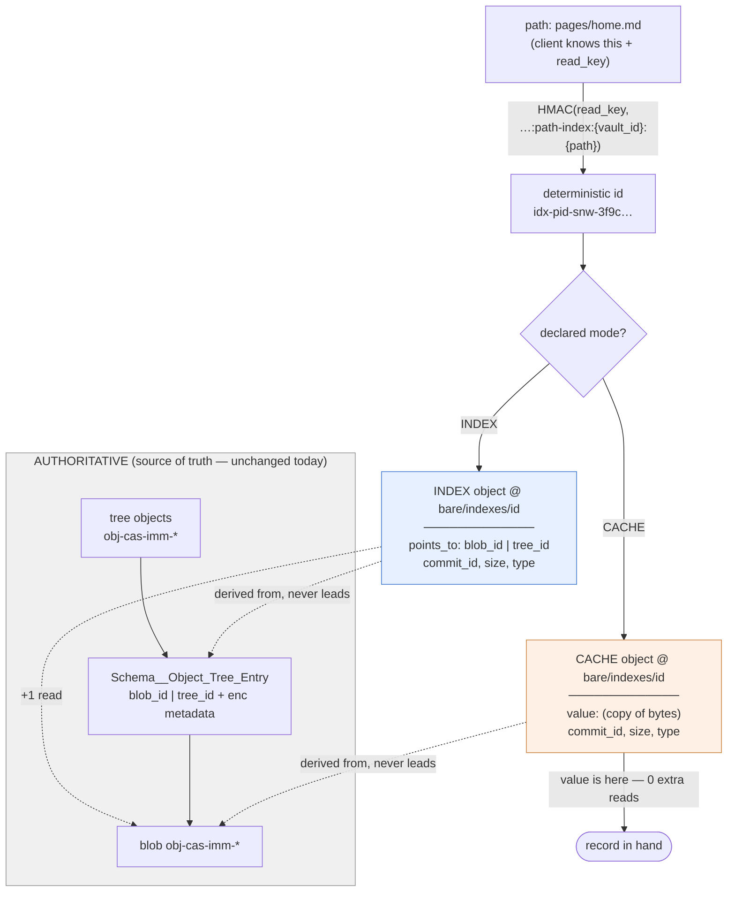
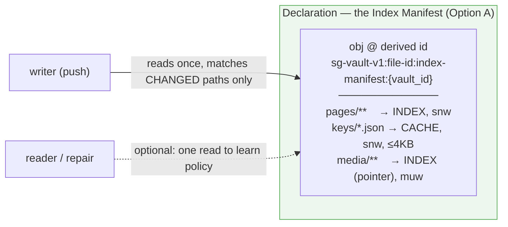
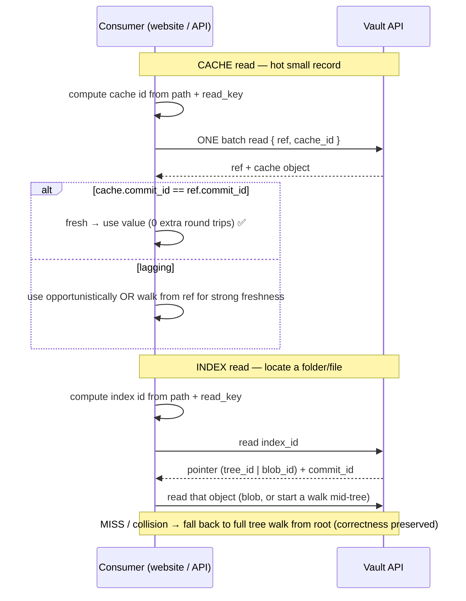
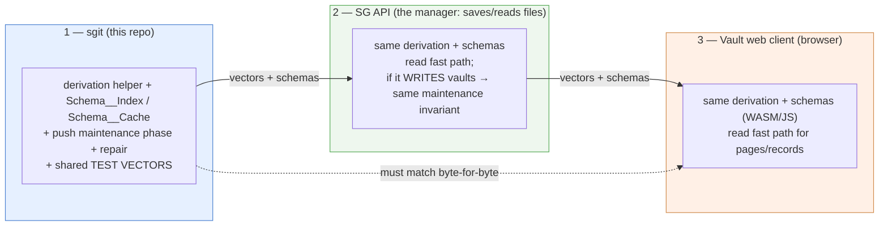

# Architecture — Index vs Cache Modes, and Where the Declaration Lives

**Author:** Fable (architect capacity) · **Date:** 2026-08-06 · **Extends:** `v0__architecture__per-path-indexes.md`
**Trigger:** project-lead refinement — split the one "index" concept into two (a stable **index/locator** and an explicit **cache/duplicate**), and decide where the "this path is indexed/cached" declaration is stored without breaking existing content.

> **Prime directive for this feature: additive, non-breaking.** It sits *on top of* existing functionality. Nothing below changes the bytes, IDs, or interop of any object that exists today unless a path is explicitly opted in — and even then, only along that path.

---

## 1. Two concepts, not one (the refinement)

v0 muddied "index holds a pointer" and "index holds a value" as two configs of one thing. They are two **different intents with different invariants**. Name them honestly:

| | **INDEX** (stable locator) | **CACHE** (explicit duplicate) |
|---|---|---|
| Fundamentally | *"where is it"* — deterministic addressability | *"here is a copy of it"* — accepted duplication |
| Holds | a **pointer**: `blob_id` (file) or `tree_id` (folder/subtree) + metadata | a **copy of the value** + metadata |
| Reads | 1 to resolve the pointer, +1 for content (collapses tree **depth** to one locator read) | **1** — the value comes back whole |
| Primary risk | a **dangling** pointer (points at nothing) | **staleness** (returns an old copy) |
| Guard | content-first / index-last write order | recorded `commit_id` + repair; never authoritative |
| Motivating case | website hitting a **specific folder / tree / file** directly; starting a walk mid-tree | API-key record, page metadata — small, hot, read constantly |

Both live at the **same deterministic location scheme** (`idx-pid-{mut}-{HMAC(read_key, domain)[:12]}` at `bare/indexes/{id}`, random IV). The difference is *what the object is for* and *how it can fail*. A CACHE is an INDEX that chose to carry the value and therefore signed up for staleness management.



INDEX and CACHE are **strictly downstream** of the tree/blob objects. Losing them is a performance problem, never a correctness one (§4 repair).

---

## 2. Where the declaration lives (your question, checked)

**You are right about the shape of the data.** `Schema__Object_Tree_Entry` (`schemas/Schema__Object_Tree_Entry.py`) *is* the per-file metadata record, and it is **separate from the binary blob**: it carries `name_enc`, `size_enc`, `content_hash_enc`, `content_type_enc`, and `blob_id` **or** `tree_id`. It is decrypted on every tree navigation — you read the *entry* to learn a file's size/type; you only touch the blob for bytes. Semantically, an `index_mode` flag belongs right there, and it even distinguishes file (`blob_id`) from folder (`tree_id`), which is what your "hit a specific folder or tree" case needs.

**But putting it there is a breaking change, and I verified why.** Tree objects are **deterministically encrypted and content-addressed** (`Vault__Sub_Tree._store_tree` → `encrypt_deterministic`), and Type_Safe **serializes `None` fields**:

```
current file entry:  {"blob_id":"obj-cas-imm-…","tree_id":null,"name_enc":…,"large":false}
add index_mode:      … "large":false,"index_mode":null}   ← every entry's JSON changes
                     ⇒ every tree's ciphertext changes ⇒ every obj-cas-imm-{hash} changes
```

Consequence: **CAS dedup against all history breaks** (same folder → new tree id → re-uploads everything) and **byte-for-byte browser/API interop breaks** (a schema field must be mirrored in all three runtimes *simultaneously* or the same content gets different ids per client). That is precisely the "don't break anything" trap.

### The three options, ranked

| Option | Non-breaking? | Cost | Verdict |
|---|---|---|---|
| **A. Side declaration object** (a per-vault *index manifest* at a fixed derived id) | ✅ by construction — no existing object touched | writer reads one manifest at push to know what to maintain | **v1 choice** |
| **B. Versioned tree entry** (`tree_v2`, field emitted only for trees containing a flagged entry) | ⚠ only touched trees change id (expected); unflagged content untouched | coordinated additive change across sgit + SG API + browser; all three must tolerate the new field | future, if in-entry carry proves worth a migration |
| **C. Naive field add** (put `index_mode` on the entry, always serialized) | ❌ re-ids every tree | — | **do not do** |

**Recommendation:** ship **A** now, keep **B** as a documented migration path. The manifest gives the "always-available, one-read" property you wanted (one object holds the whole policy) without mutating the CAS/interop-critical tree objects. It also answers "we can't check every write": the writer consults the manifest **once** per push and only re-evaluates the paths that actually changed (push already diffs the tree) — not every file, every time.



---

## 3. Write flow — content first, index/cache last (additive phase)

The only code change on the write side is a **new phase appended after the existing push completes its ref-CAS** (`core/actions/push/Vault__Sync__Push.py:272-273`). Everything before it is unchanged.

```mermaid
sequenceDiagram
    participant WD as Working dir
    participant S as sgit (push)
    participant API as Vault API (store)
    Note over WD,API: EXISTING FLOW (unchanged)
    WD->>S: build blobs + sub-trees + root tree (CAS)
    S->>API: Phase A — write blobs
    S->>API: Phase B — write commits + trees
    S->>API: write named ref (WRITE_IF_MATCH / CAS)  ← content now durable
    Note over S,API: NEW FLOW (additive, only if manifest non-empty)
    S->>S: read index manifest (1 read, cached)
    S->>S: diff changed paths vs manifest → {to_write, to_delete}
    loop matched changed paths
        alt mode = INDEX
            S->>S: build INDEX obj (pointer blob_id|tree_id + commit_id)
        else mode = CACHE
            S->>S: build CACHE obj (copy of value + commit_id)
        end
    end
    S->>API: separate batch — write index/cache objs, delete removed
    Note right of API: fails safe: content+ref already durable;<br/>index/cache merely lag until next push or repair
```

Invariants:
- **Order:** authoritative objects (blob/tree/commit) → ref → INDEX/CACHE. The cache never leads its source of truth.
- **Atomicity:** index/cache writes are a **separate batch after** the ref-CAS, so a lost CAS never strands them, and the atomic branch advance is untouched.
- **Failure is self-healing:** a crash after the ref leaves stale-or-absent index/cache objects — never dangling — corrected by the next push or a repair pass.
- **Delete/rename:** removed flagged paths emit `delete` ops; a rename is delete-old-id + write-new-id (falls out of the changed-path diff under snapshot semantics — `Enum__Batch_Op.DELETE` already exists).

---

## 4. Read flow — the one-request payoff (+ always a safe fallback)



The batched `{ref, cache}` read makes **staleness measurable at read time for free** (breadth, not depth — the same round trip). A miss (404), a `path` mismatch (48-bit id collision — see v0 §8 / security-review F5), or a stale `commit_id` all fall back to the existing tree walk, so **correctness never depends on the index/cache being present or fresh**.

---

## 5. Build sgit first, then replicate (your sequencing)

The workflow is captured in **sgit** (this repo) because it owns the write path and the reference implementation of the derivation. Once proven here, the same two artifacts — the **derivation** and the **object schemas** — are replicated to the other runtimes. The **interop test vectors are the contract**; nothing is "done" until all three agree byte-for-byte (CLAUDE.md).



⚠ **Critical for the SG API team:** if the "manager" API *writes* vaults, it must implement the §3 maintenance invariant too. A writer that skips it produces **silent, permanent, undetectable** staleness — the exact failure this design exists to prevent. (Same client/server split flagged in the 6-Aug simple-token advisory: shared identifier scheme, must not diverge.)

---

## 6. What changes, what doesn't (non-breaking checklist)

**Unchanged (verified):** `Schema__Object_Tree_Entry`, tree encryption, every `obj-cas-imm-*` id, the ref/commit format, the existing push Phases A/B, all existing reads (tree walk still works and remains the fallback). A vault with an **empty manifest behaves exactly as today** — the new phase is a no-op.

**Added (additive only):**
- `Vault__Crypto.derive_path_index_file_id(read_key, vault_id, path)` — new domain string, new helper, no change to existing derivations.
- `Schema__Index` (pointer) and `Schema__Cache` (value) — new objects at `bare/indexes/`, random IV.
- An index-manifest object (Option A) at a fixed derived id.
- A post-ref maintenance phase in `push` + `sgit index repair` + `sgit index add/rm` (or manifest edits).

**Deferred decision (yours):** Option A (side manifest, non-breaking, v1) vs eventually B (in-entry `tree_v2`, a coordinated cross-runtime migration). I recommend A now, B only if carrying the flag in the always-read entry later proves worth the migration.

---

## 7. Open questions carried forward

1. **A vs B for v1** — recommend A (non-breaking). Confirm.
2. **CACHE value threshold** — 4 KB default, per-pattern override (v0 §2).
3. **Default mutability** — `snw` for hot single-writer records; `muw` (CAS) when multi-writer.
4. **Does the SG "manager" API write vaults?** If yes, §3 invariant must live there too.
5. **Repair cadence + rebuild time** — on-demand always; server sweep periodic; measure the walk (v0 §10 Phase 3).
6. **48-bit id collision** — store+verify `path` in the object now; widen `derive_file_id` later (security-review F5).

*This refines v0 with the Index/Cache split and resolves the declaration-storage question empirically: the tree entry is the semantically right home but a breaking one, so v1 keeps the declaration in a side manifest and treats in-entry carry as a future versioned migration. Build in sgit, prove the workflow, replicate to the SG API and the web against shared test vectors.*
