# Mixed-Version Compatibility — Where the Index/Cache Declaration Can Safely Live

**Author:** Fable (architect capacity) · **Date:** 2026-08-06 · **Extends:** `v0.1__architecture__index-and-cache-modes.md`
**Question (project lead):** if we add a field to `Schema__Object_Tree_Entry`, does an older sgit (a) simply not update the index/cache, or (b) rewrite the entry and **strip** the declaration?

**Answer: (b), verified empirically — and it is worse than that, because the declaration is lossy even between two *new* clients.** That rules out in-entry storage as the durable home and selects the side manifest, provided it is an ordinary **tracked file**.

---

## 1. The two mechanics, verified

### M1 — An unknown field survives reading, but is destroyed on write

```
new entry JSON  {"blob_id":…, "large":false, "index_mode":"cache"}
     ↓ old client:  Schema__Object_Tree_Entry.from_json(…)
   no exception  ✅  (old clients can READ new trees — forward-compatible)
     ↓ old client:  .json()
{"blob_id":…, "large":false}                    ← index_mode SILENTLY DROPPED ❌
```

Type_Safe ignores unknown keys on `from_json` and emits only its own declared fields. So an old client never crashes — it quietly erases what it does not know about. **This is exactly case (b).**

### M2 — Trees are *rebuilt from the working directory*, never patched

`Vault__Sub_Tree.build()` → `make_entry()` constructs a **fresh** `Schema__Object_Tree_Entry(...)` per file from bytes on disk (`Vault__Sub_Tree.py:35-53`). The only state carried across commits is blob reuse via `old_flat_entries` → `encrypt_or_reuse_blob`, and `flatten()` surfaces only `blob_id / size / content_hash / content_type / large` (`Vault__Sub_Tree.py:96-105`).

There is **nowhere in the working directory for a declaration to live**. So an in-entry `index_mode` would be dropped on the very next commit **even by a new client**, unless it is explicitly plumbed through *both* `flatten()` (to surface it) and `make_entry()` (to re-apply it). It is declaration data riding inside regenerated, content-addressed data — structurally lossy, not merely version-fragile.

---

## 2. Your bullets, answered

| Your statement | Verdict |
|---|---|
| Existing vaults still work as before | ✅ — but see §3: *always-serialising* a new field re-IDs every tree (dedup churn), so the field must be version-gated, not naively added |
| Entries update one at a time as files change | ✅ for a version-gated field (only trees containing a flagged entry change id); ❌ for a naive add (all trees change at once) |
| New-sgit-only ⇒ works, index/cache auto-updates | ✅ |
| **(a) or (b) with an older sgit?** | **(b) — confirmed.** The old client rewrites the entry from the working dir with its own schema; the field is gone |
| If (b), the new version loses the reference | ✅ — and worse: the CACHE object *persists* at its derived id holding the old value, with nothing left to update it. Silent staleness, exactly the failure mode we set out to avoid. Only the recorded `commit_id` makes it detectable |
| If not (b), next new-sgit write heals it | moot — (b) holds |
| This is really about compatibility with older sgit **and the vault web client** | ✅ — the web client is a web sgit; it rebuilds trees the same way, so old web versions strip identically. And old clients exist **permanently** (installed CLIs, cached web bundles), so foreign writers are a standing condition, not a migration window |
| **Ideal: new sgit keeps working even if older versions edited the content** | ✅ **achievable — with the tracked-file manifest (Option A), not with in-entry (Option B)** |

---

## 3. Why the manifest survives and the in-entry flag does not

The manifest is an **ordinary tracked file** in the working tree (only `.sg_vault*` is always-ignored — `Vault__Ignore.py:5-6,31`). An old client does not need to understand it: it snapshots the whole folder, so it commits the manifest through **unchanged, as content**. Schema knowledge is not required to preserve content — that is the whole trick.

```mermaid
flowchart TB
    subgraph B["OPTION B — declaration inside the tree entry"]
        B1["new sgit: entry.index_mode = cache"] --> B2["OLD client edits the file"]
        B2 --> B3["rebuilds entry from working dir<br/>with its own schema"]
        B3 --> B4["declaration ERASED ❌"]
        B4 --> B5["new sgit's next push:<br/>no record the path was ever declared<br/>→ cannot heal. PERMANENT LOSS"]
    end
    subgraph A["OPTION A — declaration in a tracked manifest file"]
        A1["new sgit: manifest lists keys/*.json → CACHE"] --> A2["OLD client edits the file"]
        A2 --> A3["snapshots whole folder;<br/>manifest is just content → preserved ✅"]
        A3 --> A4["cache object is now STALE<br/>(commit_id lags head → detectable)"]
        A4 --> A5["new sgit's next push:<br/>manifest still declares it → reconcile → HEALED ✅"]
    end
    style B4 fill:#ffe6e6,stroke:#c55
    style B5 fill:#ffe6e6,stroke:#c55
    style A3 fill:#e6ffe6,stroke:#5a5
    style A5 fill:#e6ffe6,stroke:#5a5
```



**In-entry storage couples the declaration's lifetime to a data structure that every client regenerates. The manifest decouples them.**

---

## 4. The refinement that actually delivers your ideal

Self-healing does **not** come free from Option A. v0.1's maintenance phase diffed *paths changed in this push* — but a foreign write changes a path in *someone else's* push, so a later new-sgit push touching unrelated files would never revisit it, and the cache would stay stale indefinitely.

**Change the rule:** the maintenance phase reconciles **every declared path** against the new head, not just this push's diff.

```
for each path matching the manifest:
    current  = flatten(new_head_tree)[path]        # already in memory — no extra reads
    existing = index/cache object (id computed locally)
    if existing.commit_id != head or existing.content_hash != current.content_hash:
        rewrite (or delete if the path is gone)
```

This is cheap because declared paths are **few and opt-in** by design, and `flatten()` of the new tree is already computed during push (`Vault__Sync__Push.py:141`). It costs a dict lookup per declared path and network traffic only for entries that genuinely drifted.

**Result:** any new-sgit push heals every stale entry left by any foreign writer — which is precisely the stated ideal.

### The full mixed-version timeline

```mermaid
sequenceDiagram
    participant NS as new sgit
    participant V as Vault (server)
    participant OS as OLD sgit / old web
    participant R as Reader (web/API)
    NS->>V: push — cache(keys/api.json) written @ C1 ✅
    R->>V: batch {ref, cache} → both C1 → FRESH, 1 round trip ✅
    OS->>V: edits keys/api.json, pushes → head C2
    Note over OS,V: manifest preserved (ordinary content);<br/>cache object untouched → now STALE
    R->>V: batch {ref, cache} → ref C2 vs cache C1 → STALE DETECTED
    R->>V: fall back to tree walk → CORRECT data (slower) ✅
    NS->>V: next push (any change) — reconcile ALL declared paths
    NS->>V: cache(keys/api.json) rewritten @ C3 → HEALED ✅
    R->>V: batch {ref, cache} → both C3 → fresh again ✅
```

At no point is a **wrong** answer returned: the worst case is *stale-but-detectable*, and the reader's fallback is the existing tree walk. Correctness never depends on the cache being present or fresh.

---

## 4b. Worked example — what is the blast radius?

> **Correction (supersedes an earlier draft).** An earlier version of this section said "every commit regenerates every tree entry in the vault", which was imprecise and understated the existing optimisation. Three distinct layers must be separated — the first is unoptimised, the second is *well* optimised, and only the third drives the compatibility conclusion.

| Layer | Behaviour | Optimised? |
|---|---|---|
| **1. In-memory re-derivation** | `Vault__Sync__Commit` scans the whole directory and `sub_tree.build()` calls `make_entry()` for **every** file — there is no subtree-level short-circuit | ❌ no |
| **2. Object identity / storage / network** | That re-derivation is *engineered to be byte-identical* for unchanged content, so unchanged subtrees yield the **same** `obj-cas-imm-{id}` → nothing new stored, nothing re-uploaded | ✅ **yes — this is the optimisation** |
| **3. Field preservation** | Entries are **reconstructed, not copied**, so any field the writing client's schema lacks is dropped — untouched by layers 1–2 | ❌ no (the compatibility problem) |

Layer 2 is deliberate and documented in the code: `encrypt_deterministic` exists *"so that unchanged subtrees produce identical object IDs across commits (true CAS deduplication)"* (`Vault__Crypto.py:162-168`), alongside blob-level reuse in `encrypt_or_reuse_blob` (`Vault__Sub_Tree.py:135-147`). **The re-derivation in layer 1 is cheap precisely because layer 2 makes it produce identical bytes.** My own simulation confirms it below (NEW client: untouched subtrees keep their ids).

**So the answer to "only the file, or also its folders?" is: neither — but the two radii differ.**

- **Declaration loss is vault-wide.** *Every* declared path loses its flag on any old-client commit, wherever the edit happened.
- **Tree churn is scoped**, to trees that actually contain declared entries plus their ancestor chain to root. A subtree with no declarations serialises identically and keeps its id.

Vault under test (`/other` added as a control — no declarations, never edited):

```
/api-keys/api-key-1.json         ← INDEX (pointer)
/api-keys/api-key-2/data.json    ← CACHE (value)
/api-keys/api-key-2/info.md
/docs/file-1.txt
/docs/file-2.md
/other/thing.txt                 ← control: undeclared, untouched
```

Simulated with the real crypto + schema, editing **only `/docs/file-1.txt`**:

| tree | NEW client edits | OLD client edits |
|---|---|---|
| `api-keys/api-key-2` | same id ✅ | **CHANGED** (churn) |
| `api-keys` | same id ✅ | **CHANGED** (churn) |
| `docs` | CHANGED (expected) | CHANGED (expected) |
| `other` *(control)* | same id ✅ | **same id ✅** |
| `root` | CHANGED (expected) | CHANGED (expected) |

Read this carefully, because it shows both effects at once:

- **The optimisation works.** Under the NEW client, every untouched subtree keeps its id — nothing is re-stored or re-uploaded. And `other` keeps its id under **both** clients, confirming churn is not vault-wide.
- **But `api-keys/*` changes under the OLD client** despite being nowhere near the edit — because its entries carried `index_mode` and were rebuilt without it.

So there is a second, independent cost to Option B that lands squarely in your performance terms: **an old-client commit doesn't just erase declarations, it defeats CAS dedup for exactly the subtrees you cared enough about to declare**, forcing them to be re-stored and re-uploaded on the next push. Option A causes none of this — entries stay byte-identical, so every unchanged subtree keeps its id and the optimisation is fully preserved.

### Per-file outcomes

**Option B (in-entry) — any old-client commit anywhere:**

| File | Outcome |
|---|---|
| all declared paths | declaration **erased**; index/cache objects orphaned at their derived ids, holding old values, with nothing left to update them. New sgit cannot heal — it has no record the paths were ever declared. **Permanent, silent.** |

**Option A (manifest file) — by scenario:**

| Scenario | `api-key-1.json` INDEX | `api-key-2/data.json` CACHE | Declaration |
|---|---|---|---|
| NEW client edits `/docs/file-1.txt` | valid (blob unchanged) | valid | intact ✅ |
| **OLD** client edits `/docs/file-1.txt` | **still valid** — the pointer targets an unchanged blob; only the `commit_id` marker lags | **still valid** | intact ✅ |
| **OLD** client edits `api-key-1.json` | stale — points at the previous blob, serves old content; detectable via `commit_id` ≠ head | unaffected | intact ✅ |
| **OLD** client edits `data.json` | unaffected | stale — holds the old value; detectable | intact ✅ |
| **OLD** client deletes `api-key-1.json` | orphaned — serves content the vault no longer tracks (the brief's "worse than no index") until reconciled | unaffected | intact ✅ |

In every Option A row the declaration survives, so **the next new-sgit push reconciles all declared paths and heals whatever drifted** (§4). Note the pleasant property in row 2: an old client editing an *unrelated* file does not even make the index wrong — the pointer still resolves correctly, and only the freshness marker falls behind.

---

## 5. Recommendation

**Declaration = tracked manifest file (Option A).** Durable across foreign writes, needs no schema knowledge from old clients, and delivers the self-healing property.

**Optional future: entry hint (hybrid).** Once a `tree_v2` migration is worth doing, the entry may carry `index_mode` as a *hint* so a reader already walking the tree learns "this path has a cache" without reading the manifest. Critically the hint is **derived and disposable** — the manifest stays authoritative, and an old client stripping the hint costs a manifest read, nothing more. This respects the brief's own rule: *the index must contain nothing that cannot be recomputed.*

**Do not** add an always-serialised field to `Schema__Object_Tree_Entry` (Option C): it re-IDs every tree, breaking CAS dedup against all history and making old/new clients compute different ids for identical content.

| Property | A: manifest file | B: in-entry | C: naive field |
|---|---|---|---|
| Survives old-client writes | ✅ | ❌ erased | ❌ erased |
| Survives new-client commits without extra plumbing | ✅ | ❌ needs `flatten`+`make_entry` changes | ❌ same |
| Existing tree ids unchanged | ✅ | ⚠ only flagged trees | ❌ all trees |
| Cross-runtime schema change needed | ✅ none | ⚠ coordinated | ⚠ coordinated |
| Self-healing after foreign write | ✅ (with §4) | ❌ | ❌ |

---

## 6. Consequence for the SG API and the web client

Because old clients strip silently and exist permanently, **every writer must either maintain the declared indexes or leave them detectably stale — never destroy the declaration.** Option A guarantees the latter for free: a writer that knows nothing about this feature still preserves the manifest, and its writes are healed by the next aware writer.

The reciprocal ask stands from v0.1 §5: if the SG "manager" API **writes** vaults, it should implement the §4 reconciliation too — otherwise vaults it writes are healed only when an sgit client next pushes. That is safe (stale-but-detectable), just slower to converge.

---

*Empirically established: unknown fields survive reads and are destroyed on writes; trees are rebuilt from the working directory, so in-entry declarations are structurally lossy. The declaration therefore lives in a tracked manifest file, and the maintenance phase reconciles all declared paths — together these give the stated ideal: new sgit keeps working, and heals, even when older clients have edited the content.*
