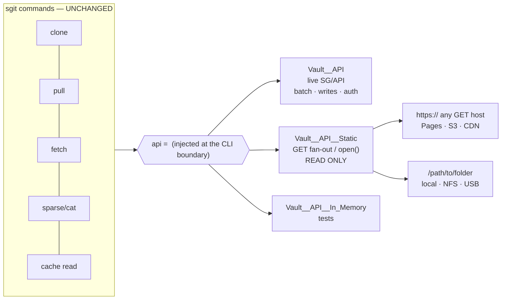
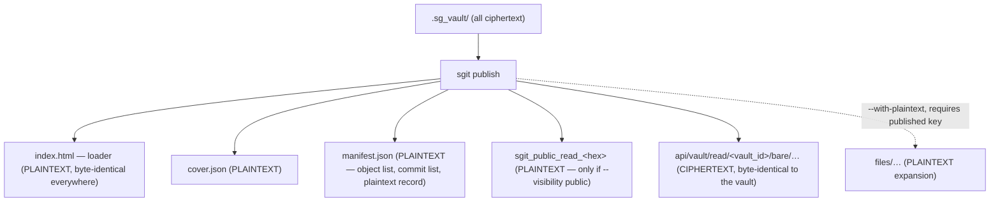
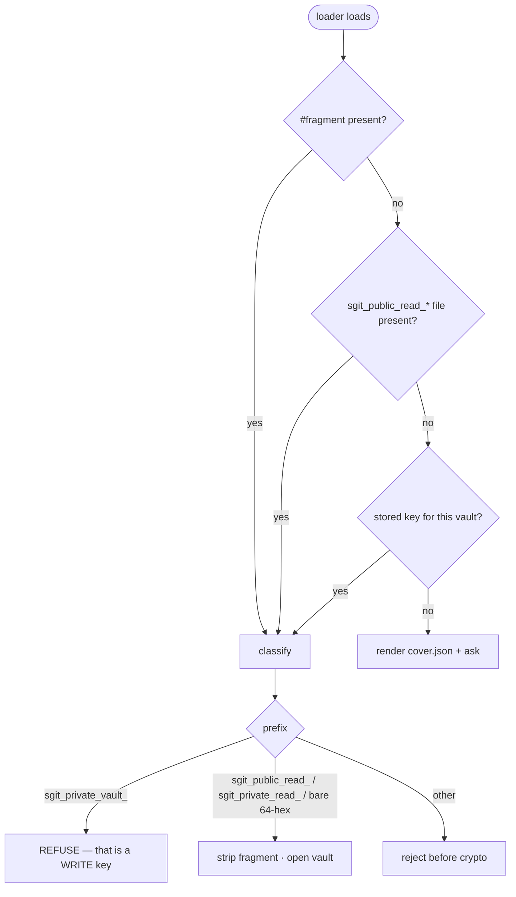
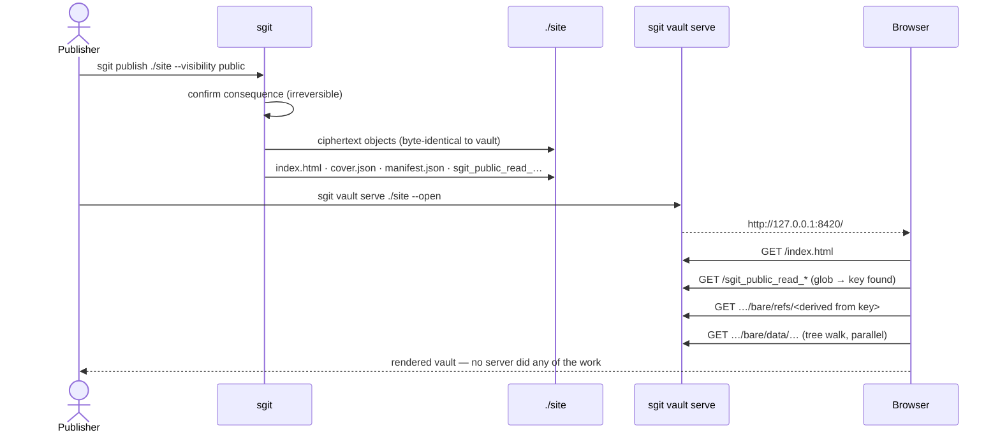
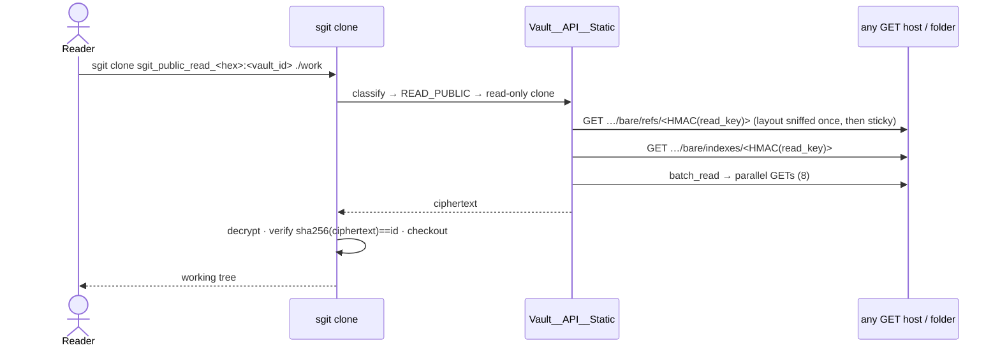
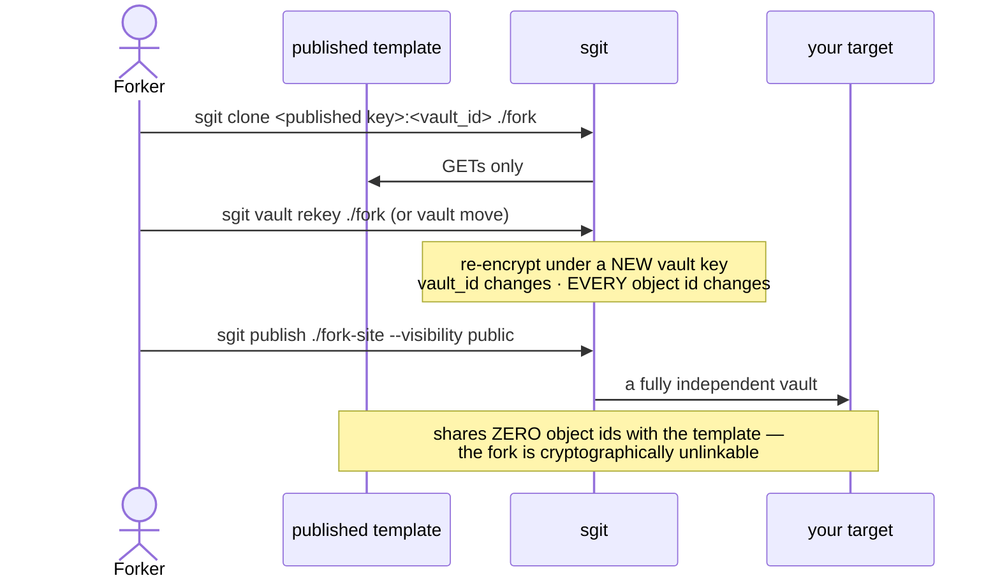

# Dev Pack — Static Publishing, `sgit vault serve`, and the Publishing Matrix

**Version:** v0 · **Date:** 2026-08-17 · **Owner:** sgit CLI team
**Implements:** the 08/16 publishing-matrix dev brief, the publish-protocol brief, and the loader-page brief
**Status:** BUILD SPEC — ready to implement. Two of the briefs' open questions are answered here with evidence, and one answer reverses a design assumption.

---

## 0. Two questions settled before we build

### Q: "Does the pages host permit cross-origin reads by default?" → **YES**

The brief assumes it does not (*"on a pages host it is not configurable at all"*) and treats
test 10 as probably-unavailable. Measured against the API team's live deployment:

```
$ curl -sI https://sgit-ai.github.io/SGit-AI__API/
HTTP/2 200
access-control-allow-origin: *          <- present by default, and with an Origin header too
```

**Test 10 is supported, not merely tolerated.** A loader on `sgit.ai` may fetch a key file
from `github.io`, and vice versa. The design does not need to route around it, and the
"key file as a pointer" indirection is now a *choice* rather than a workaround — we still
recommend it (§4.3), because it lets a key move without republishing.

### Q: custody without access — **requires a manifest, and cannot work without one**

Test 11 as written ("a bare clone succeeds with no key at all") **cannot be satisfied by
`sgit clone` against an API**, and the reason is structural: *every* filename in a vault is
either `HMAC(read_key, …)` (refs, indexes, caches) or a content hash learned by decrypting a
tree. **With zero key material a client cannot name a single file to fetch.**

So custody works only when the file *names* arrive some other way:

| Custody route | Works? | Why |
|---|---|---|
| `git clone` / folder copy / zip of a published target | ✅ | the filesystem is the listing |
| `sgit vault mirror <url>` with a published `manifest.json` | ✅ | the manifest is the listing |
| `sgit vault mirror <url>` with host directory listing | ⚠️ | only where the host offers one |
| `sgit clone <url>` with no key | ❌ **impossible** | nothing is nameable |

**Consequence for the build:** `manifest.json` is not an optimisation, it is the enabling
artefact for invariant 3. It is promoted to a required part of the published layout (§3.1).

---

## 1. Scope

| In | Out |
|---|---|
| `sgit publish` — vault → published folder, all targets | the loader's internal JS (Web team) |
| `sgit vault serve` — serve a published folder locally | a hosted/multi-tenant server |
| `sgit vault mirror` — custody without access | write-back to a static target (impossible by design) |
| static transport productionised (`Vault__API__Static`) | `Vault__Backend` interface rework (deferred, see 08/17 response §C2) |
| the 5 invariants + 14 tests as a suite | the cover/catalogue *indexing* service |

---

## 2. Architecture

### 2.1 The one seam that makes this small



Every action already takes `api=`. The static transport is a **sibling class, injected** —
no call-site changes (proven: `scripts/spike__static_vault_transport.py` clones from Pages,
a dumb HTTP server, and a folder, with zero edits to clone/pull/fetch).

Four methods carry the entire read path:

| Method | Static implementation |
|---|---|
| `batch_read(vault_id, ids)` | bounded parallel GETs (8 HTTP / 1 local), 404 ⇒ `None` not error |
| `read(vault_id, id)` | one GET / `open()` |
| `presigned_read_url(...)` | returns the object's own URL (`urlopen` handles `file://`) — **required**, large blobs use it |
| `list_files(prefix)` | local: walk. HTTP: read `manifest.json`, else `[]` |
| `write` / `delete` / `batch` | raise `Vault__Read_Only_Transport_Error` |

### 2.2 Publish is a projection, not a copy

The vault is fully encrypted; the published output has a **small, fixed, declared plaintext
surface**. That inversion is the publish step's entire job and the highest-risk part of it.



### 2.3 Key discovery (loader), mirroring the CLI's precedence rule



The CLI already ships this classifier — `Vault__Crypto.classify_key()` →
`Enum__Key_Kind` — so the loader ports it rather than reinventing it.

---

## 3. The published layout (protocol item 1 — decide this first, everything depends on it)

### 3.1 Canonical output

```
<output>/
├── index.html                              PLAINTEXT  loader (generated, byte-identical)
├── cover.json                              PLAINTEXT  title/description/image/updated/access/public
├── manifest.json                           PLAINTEXT  REQUIRED — see 3.2
├── sgit_public_read_<64-hex>               PLAINTEXT  only when --visibility public
├── api/vault/read/<vault_id>/bare/
│   ├── refs/ref-pid-muw-…                  CIPHERTEXT mutable — short cache TTL
│   ├── indexes/… keys/… data/…             CIPHERTEXT immutable — cache forever
│   └── cache/…                             CIPHERTEXT optional, 1-batch hot reads
├── bundles/head-<commit>.zip               optional   head snapshot (ZIP_STORED)
├── bundles/<commit>.zip                    optional   per-commit delta
└── files/…                                 PLAINTEXT  only with --with-plaintext (+ published key)
```

**Why the `api/vault/read/<vault_id>/…` prefix**: the same URL then works against the live
API and the static projection, which is the stated goal. Our transport auto-sniffs the flat
layout too, so a bare `bare/…` tree still clones — but the canonical emit is the API layout.

### 3.2 `manifest.json` — required, three jobs

```jsonc
{
  "schema": "sgit_published_v1",
  "vault_id": "ivpijuvg",
  "generated_by": "sgit v0.15.6",
  "layout": "api-path",                    // or "flat"
  "visibility": "public",                  // bare | named | public
  "plaintext_surface": [                   // JOB 3: auditable — "nothing else is exposed"
    {"path": "index.html",   "sha256": "…"},
    {"path": "cover.json",   "sha256": "…"},
    {"path": "manifest.json","sha256": null},
    {"path": "sgit_public_read_c28b…", "sha256": "…"}
  ],
  "objects": [                             // JOB 1: custody — filenames without a key
    {"file_id": "bare/refs/ref-pid-muw-1995ccf51fe8", "size": 69},
    {"file_id": "bare/data/obj-cas-imm-…",            "size": 8871}
  ],
  "commits": ["obj-cas-imm-…head", "obj-cas-imm-…parent"],  // JOB 2: parallel bundle fetch
  "head": "obj-cas-imm-…head"
}
```

Three jobs, none optional:
1. **Custody** (§0) — the only way a keyless client can name files.
2. **Parallel bundles** — without an ordered commit list, per-commit bundles must be fetched
   *serially* (you cannot know commit N−1's id before decrypting commit N).
3. **Auditability** — the plaintext surface is *declared and hashed*, so invariant 5 is
   verifiable by inspection rather than trusted.

### 3.3 The plaintext surface: fixed names, never patterns

**Requirement:** the set of plaintext files is an explicit allow-list in code. It must NOT be
derived by matching vault content (e.g. "anything called `index.html`"), because then anyone
who can write to the vault — a collaborator, a compromised agent — can move a file into the
plaintext surface by naming it. This is the cache layer's silent-drift failure shape applied
to a disclosure boundary.

**The loader is emitted from sgit's bundled template, always.** If the vault also contains a
loader file, it is treated as ordinary content (encrypted, expanded only with a key). That
guarantees invariant 4 (byte-identical loader) by construction and keeps "generated rather
than hand-edited" true. `sgit vault loader --install` can commit a copy into the vault so it
travels with folder copies, but publish never trusts it.

---

## 4. Command surface & UX mockups

### 4.1 `sgit publish`

```
sgit publish <output-dir> [--visibility bare|named|public] [--with-plaintext]
                          [--bundles] [--layout api-path|flat] [--force]
```

**Baseline — private ciphertext-only publish (the safe default):**

```console
$ sgit publish ./site
Publishing vault q7r6d5zd → ./site

  Ciphertext objects   13  (15 KB)      api/vault/read/q7r6d5zd/bare/…
  Plaintext surface     3               index.html, cover.json, manifest.json
  Visibility           bare             no key published — readers supply their own

Published. Next:
  sgit vault serve ./site        — browse it locally (a local folder cannot be opened directly)
  sgit clone <read-key>:q7r6d5zd — clone it back from any GET host
```

**Public publish — the consequence is stated, not implied:**

```console
$ sgit publish ./site --visibility public

  ⚠ This publishes the READ KEY alongside the vault.
    Anyone with the URL can read every file in it, now and in every future
    publish of this content. This cannot be undone: copies cannot be recalled.
    Continue? [y/N] y

  Ciphertext objects   13  (15 KB)
  Plaintext surface     4               + sgit_public_read_c28b118c…
  Visibility           public           key published in the folder

Published.
```

**The enforced constraint (invariant 5) — refuses, and says why:**

```console
$ sgit publish ./site --with-plaintext
error: --with-plaintext requires --visibility public.

  Expanded plaintext adds nothing to a vault whose key is already published,
  and everything to one whose key is not.

  This is irreversible on a git-hosted target: plaintext committed to a
  repository stays in its history even if the vault is closed later.

  Either:  sgit publish ./site --with-plaintext --visibility public
  Or:      sgit publish ./site                    (ciphertext only)
```

**Git-hosted irreversibility warning (from the 08/17 measurement):**

```console
$ sgit publish ./docs --visibility public          # ./docs is inside a git repo
  note: this output is inside a git repository.
        Published bytes stay in git history after any later deletion, so
        rotation cannot revoke access to what you publish now.
        Publish to object storage instead if you may need to revoke.
```

### 4.2 `sgit vault serve` — the command that turns a failing cell into a working one

```
sgit vault serve [<dir>] [--port N] [--open] [--bind 127.0.0.1]
```

Browsers give every `file://` document an **opaque origin**, so a loader opened by
double-click cannot fetch the objects beside it. This is not a bug to document — it is a
command to ship. It also fixes test 3 (unpacked zip), because unpacking yields a folder.

```console
$ sgit vault serve ./site --open

  Serving   ./site
  Vault     q7r6d5zd  ·  13 objects  ·  visibility: public
  URL       http://127.0.0.1:8420/
  Loader    http://127.0.0.1:8420/index.html

  Why this command exists: browsers give local files an opaque origin, so
  opening index.html directly cannot fetch the objects next to it.

  Read-only. Bound to 127.0.0.1 (use --bind 0.0.0.0 to expose on the LAN).
  Ctrl-C to stop.

  GET /index.html                                            200   1.9 KB
  GET /api/vault/read/q7r6d5zd/bare/refs/ref-pid-muw-1995…   200    69 B
  GET /api/vault/read/q7r6d5zd/bare/data/obj-cas-imm-…       200   8.7 KB
```

Run inside a vault with no argument → publish to a temp dir and serve that:

```console
$ sgit vault serve
  No published folder given — publishing to a temporary folder first.
  (ephemeral: /tmp/sgit-serve-q7r6d5zd, removed on exit)
  URL  http://127.0.0.1:8420/
```

Defaults that matter: **bind 127.0.0.1** (not 0.0.0.0), **read-only**, **no directory
listing**, and it never serves anything outside the target folder (path-guarded).

### 4.3 `sgit vault mirror` — custody without access

```console
$ sgit vault mirror https://sgit-ai.github.io/SGit-AI__API ./mirror
  Reading manifest.json … 13 objects (15 KB)
  Mirroring   13/13   ████████████████████  done

  Custody without access.
  You now hold a complete, verifiable copy of vault ivpijuvg.
  You cannot read it: no key was used, and none is stored here.
  Verify:  sgit vault mirror --verify ./mirror     (checks every object hash)
  Read it: sgit clone <read-key>:ivpijuvg ./work   (when you have a key)
```

Without a manifest and without a host listing, it must fail honestly:

```console
error: cannot mirror without a listing.
  This host offers no directory listing and the folder has no manifest.json,
  so no filename can be derived — every name in a vault comes from the read key.
  Ask the publisher to republish with sgit ≥ 0.15.6 (which always emits a manifest).
```

### 4.4 The loader with no key and no cover (test 9 — the stranger's first view)

```
┌──────────────────────────────────────────────┐
│  🔒  Encrypted vault  ivpijuvg               │
│                                              │
│  This vault is published but not public.     │
│  Its contents are encrypted; this page and   │
│  the host cannot read them.                  │
│                                              │
│  ┌────────────────────────────────────────┐  │
│  │ Paste a read key to open…              │  │
│  └────────────────────────────────────────┘  │
│                    [ Open ]                  │
│                                              │
│  Have a link with a key? Open that instead.  │
│  13 objects · 15 KB · updated 17 Aug 2026    │
└──────────────────────────────────────────────┘
```

With a `cover.json`, the same page shows title, description, image and an `access` line
("Request access: team@example.com") — a closed vault that is nonetheless linkable.

And the refusal that the key classifier makes possible:

```
⚠  That is a VAULT key (sgit_private_vault_…), which can modify this vault.
   This page only ever needs your read key, and should never receive a write key.
   Get it with:  sgit vault derive-keys <your-vault-key>
```

---

## 5. Flows

### 5.1 Publish → serve → read (the baseline, test 1)



### 5.2 Static clone (proven working today)



### 5.3 Fork = clone + rekey + republish (test 14, the acceptance test)



**Measured facts this flow must document:** a rekey changes the vault_id and **100% of object
ids** (0 of 8 preserved), so a fork is a new deployment, not a delta — and forks share no
identifiers, so derivation is undetectable (and equally, template-diffing by id is
impossible).

---

## 6. The five invariants as automated assertions

`tests/qa/test_QA__Scenario_4__Publishing_Matrix.py`, asserted in **every** cell via a shared
harness rather than as individual cases.

| # | Invariant | How it is asserted |
|---|---|---|
| I1 | ciphertext byte-identical regardless of destination | publish to folder / zip / "bucket" / repo dir; `sha256` the ciphertext subtree of each; assert all equal |
| I2 | the server never receives the key | the static transport records every request URL; assert no request path or query contains the read key, any 64-hex string, or `sgit_private_` |
| I3 | a keyless client can take custody | `mirror` with **no key material in scope**; assert byte-equality with the source and that no `.sg_vault/local/*key*` is written |
| I4 | the loader is byte-identical everywhere | publish N different vaults; assert `sha256(index.html)` is identical across all, and equal to the bundled template |
| I5 | plaintext only where the key is published | property test: for every visibility × plaintext combination, assert `--with-plaintext` without `--visibility public` **exits non-zero and writes nothing** |

I2's implementation note: assert on the *recorded requests*, not on the code — that is what
makes it a real check rather than a restatement of intent.

## 7. The fourteen tests → files

| # | Cell | Where |
|---|---|---|
| 1 | baseline end to end | `tests/qa/…Publishing_Matrix.py::Test_Baseline` |
| 2 | local folder + `serve` | `…::Test_Local_Folder_Requires_Serve` — assert `file://` guidance is printed, and that serve makes it work |
| 3 | zip → unpack → serve | `…::Test_Zip_Target` (depends on serve) |
| 4 | object storage | `…::Test_Object_Storage` (dumb HTTP host stands in) |
| 5 | repository → pages round trip | `tests/integration/…::Test_Pages_Round_Trip` — real HTTP |
| 6 | payload + plaintext | `…::Test_Plaintext_Payload` (+ the I5 refusal) |
| 7 | key absent, fragment | loader-side (Web) + CLI parity test on `classify_key` |
| 8 | key absent, stored | Web |
| 9 | key absent, nothing | `…::Test_Cover_Only` — cover renders, ask is clear |
| 10 | key on another origin | `tests/integration/…::Test_Cross_Origin_Key` — **verified supported**, assert the ACAO header at run time so a platform change fails the suite |
| 11 | custody | `…::Test_Custody_Without_Access` (= I3, plus the no-manifest failure message) |
| 12 | clone then expand | `…::Test_Clone_Then_Expand` |
| 13 | no vault app | `…::Test_Generic_Browsing` |
| 14 | **fork** | `…::Test_Fork_Round_Trip` — the acceptance test |

---

## 8. Implementation plan

| Phase | Deliverable | Files | Risk |
|---|---|---|---|
| **P1** | Static transport, productionised | `sgit_ai/network/api/Vault__API__Static.py`, `Enum__Transport.py`, CLI `--transport auto\|api\|static\|local`, transport reported in `vault info` | low — spike proven, zero call-site changes |
| **P2** | `manifest.json` + `sgit publish` (ciphertext only) | `sgit_ai/core/actions/publish/Vault__Publish.py`, `Schema__Published_Manifest.py`, `CLI__Publish.py` | **medium — the plaintext-surface allow-list is the risk; fixed names, recorded, tested** |
| **P3** | `sgit vault serve` | `sgit_ai/cli/CLI__Serve.py`, `sgit_ai/network/serve/Vault__Static_Server.py` | low — stdlib `ThreadingHTTPServer`, path-guarded, read-only |
| **P4** | Visibility flags + I5 enforcement + cover | `--visibility`, `Schema__Vault_Cover.py`, visibility recorded in the vault | medium — a visibility default that drifts is a disclosure; must be recorded, never inferred |
| **P5** | `sgit vault mirror` (custody) | `CLI__Mirror.py` | low |
| **P6** | Bundles (`head-<commit>.zip`, per-commit deltas) | `Vault__Publish__Bundles.py` | low, deferrable — 338 GETs → 2 |
| **P7** | The 5 invariants + 14 tests | QA scenario 4 + integration | — |

**Sequencing note:** P3 (`serve`) unblocks two test cells and is the smallest useful thing —
consider shipping P1+P3 first so the feature is demonstrable before the publish protocol is
finalised.

### Reuse, not new code
- transport: the spike is the design; promote it, add `Enum__Transport` and typed errors.
- key handling: `classify_key` / `format_read_key(public=True)` shipped in `67c2ab6`.
- integrity: object ids are `sha256(ciphertext)` — verification is free and should be
  **unconditional on every transport**, which matters most when the host is untrusted.
- serve: stdlib only. No new dependency for a product whose claim is that no server is needed.

---

## 9. Decisions needed from the maintainer

| # | Decision | Our recommendation |
|---|---|---|
| 1 | Canonical layout: `api/vault/read/<vault_id>/…` or flat `bare/…`? | **api-path** — same URL works live and static; we sniff both anyway |
| 2 | Is the loader always sgit's bundled template, even if the vault contains one? | **Yes** — guarantees invariant 4 by construction; a vault copy is a convenience, never the source |
| 3 | Key file: the key itself, or a pointer to it? | **Support both**; default to the key, since cross-origin is now confirmed working and a pointer adds a failure mode |
| 4 | Does `serve` bind 127.0.0.1 only by default? | **Yes**, `--bind` to widen, printed loudly |
| 5 | Default visibility | **bare** |
| 6 | Ship P1+P3 before the publish protocol is final? | **Yes** — `serve` + static clone is demonstrable value with no protocol commitment |

---

*Evidence base: `scripts/spike__static_vault_transport.py` (Pages/HTTP/folder clones),
`scripts/spike__measure_commit_bundles.py` (bundle economics), CORS and rekey measurements
in `team/explorer/architect/reviews/08/17/`.*
